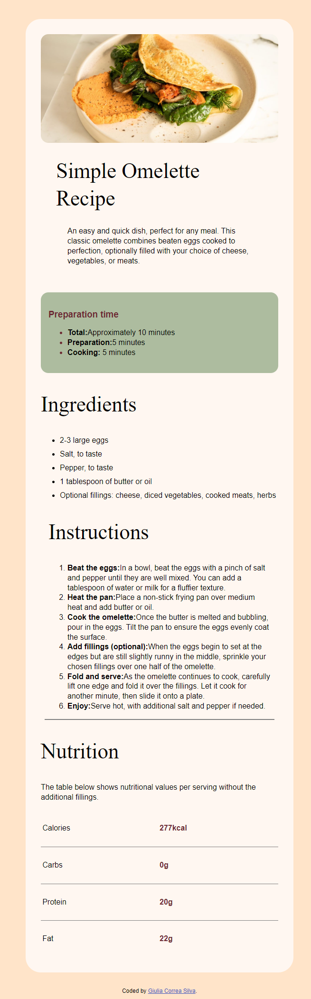

## Overview

### Screenshot



## My process

### Built with

- Semantic HTML5 markup
- CSS custom properties
- CSS Grid

### What I learned


```html
<h1>I did learn something new writing this piece of html, editing this in css to become a table was a fun chalange</h1>

  <div class="nutrition-step">
    <h2>Nutrition</h2>
    <p class="values">The table below shows nutritional values per serving without the additional fillings.</p>
    
    <div class="nutrition-table">
      <div class="item">
        <p>Calories</p>
        <p class="amount">277kcal</p>
      </div>
      <div class="item">
        <p>Carbs</p>
        <p class="amount">0g</p>
      </div>
      <div class="item">
        <p>Protein</p>
        <p class="amount">20g</p>
      </div>
      <div class="item">
        <p>Fat</p>
        <p class="amount">22g</p>
      </div>
    </div>

  </div>

```
```css

This is how i made the html code from above look like a teble using css.

.nutrition-step .values {
    margin-bottom: 1rem;
}

.nutrition-table .item {
    padding: .75rem .2rem;
    display: flex;
    border-bottom: 1px solid gray;
}

.nutrition-table  .item:last-child {
    border-bottom: 0;
}

.nutrition-table  .item p:nth-child(2){
    color: #6D2932;
    font-weight: 700;
}

.nutrition-table  .item > * {
    width: 100px;
    margin-right: auto;
}

## Author

- Frontend Mentor - [@GiuliaCorrea100](https://www.frontendmentor.io/profile/GiuliaCorrea100)